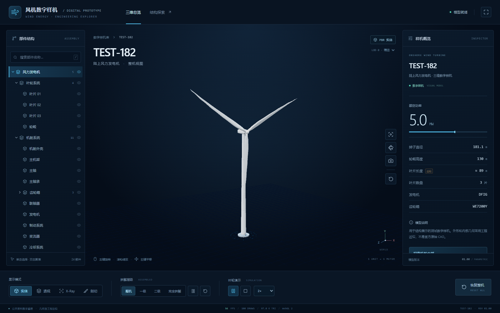
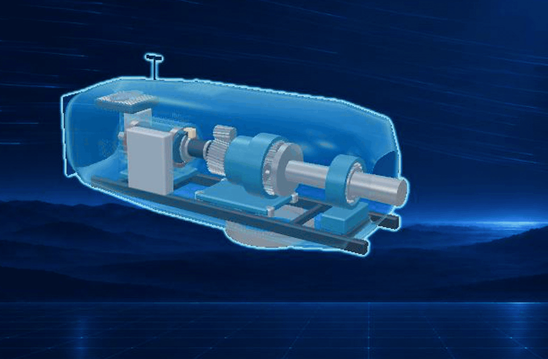
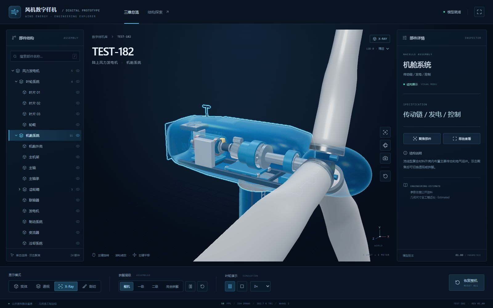
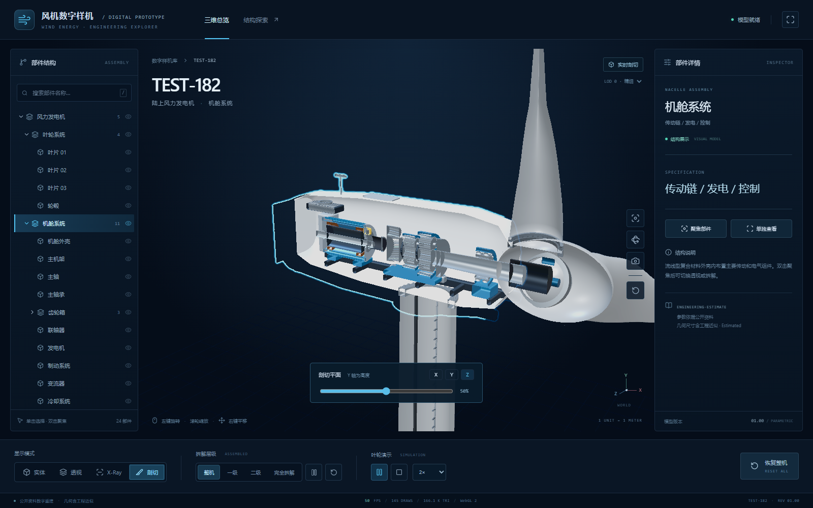

# 把一台 5 MW 风机做成可拆解的网页 3D 数字样机

这不是一张 AI 效果图，也不是一份可用于制造的原厂 CAD。

本项目以公开资料为边界，将一台叶轮直径 **181.1 m**、轮毂高度 **130 m** 的 5 MW 风力发电机，制作成可在浏览器中旋转、选择、拆解、透视和剖切的 Web3D 数字样机。最终交付包括可编辑的 Blender 源场景、三档 Draco 压缩 GLB，以及一个无需安装三维软件即可运行的静态网页。

它适合用于设备结构讲解、展厅/大屏演示、培训和远程沟通；不用于制造、强度校核、认证、施工或运维决策。



*整机界面：部件树、实时 WebGL 视口、结构说明与控制台集中在同一屏。*

## 项目完成了什么

网页中的模型不是一个不可分割的外壳，而是由 **24 个具有稳定身份的语义部件**组成。用户可以通过部件树或直接点击模型，定位到叶片、轮毂、塔筒、机舱外壳、主轴、主轴承、齿轮箱、发电机、制动系统、变流器等结构。

|能力|说明|
|---|---|
|实时浏览|鼠标/触屏旋转、平移、缩放；整机取景、自动环绕、全屏和 PNG 截图。|
|结构理解|部件选择、高亮、镜头聚焦、隐藏/显示与单独隔离查看。|
|内部观察|实体、外壳透视、Fresnel X-Ray 与 X/Y/Z 三轴实时剖切。|
|拆解演示|整机、一级、二级和完全拆解四档；GSAP 驱动的 2 秒动画支持暂停、继续和精确复位。|
|运行演示|叶轮启动、暂停、停止及 0.25/0.5/1/2 倍演示速度。|
|多端适配|LOD 0/1/2 可手动切换；移动端默认加载轻量 LOD 2。|



*动态图：机舱外壳以 X-Ray 方式呈现，主轴、齿轮箱、发电机与控制部件仍可清楚观察。素材直接录制自项目页面。*



*机舱近景：选择部件后可聚焦到传动链，并通过半透明外壳查看内部空间关系。*



*实时剖切：可在 X、Y、Z 三个方向移动裁切平面，观察机舱、叶轮与塔筒的内部关系。*

### 模型事实

|项目|当前结果|
|---|---:|
|额定功率|5 MW|
|轮毂高度|130 m|
|叶轮直径|181.1 m|
|叶片数量与间隔|3 片 / 120°|
|LOD 0 / 1 / 2 三角面|88,864 / 58,384 / 26,600|
|LOD 0 / 1 / 2 GLB 体积|约 447 / 354 / 232 KB|
|LOD 0 网格与材质|88 个网格 / 9 套无纹理 PBR 材质|

上述三档 GLB 均保留语义部件及层级关系；降低精度不会让交互所需的部件身份消失。详细检查结果见 [docs/model-check.json](docs/model-check.json) 与 [docs/acceptance.md](docs/acceptance.md)。

## GPT-6 + Blender 是怎样实现的

这次实践的重点不是让 AI 一次猜中所有细节，而是把复杂工作拆成可检查、可返回修改的生产链。GPT-6 参与资料边界梳理、参数设计、Blender Python 脚本、网页交互代码和测试排查；Blender 负责将参数真正转换为可编辑的三维几何。

```text
公开资料与参数边界
        ↓
JSON 配置（尺寸、来源标记、LOD 参数）
        ↓
Blender Python 参数化建模
        ↓
语义部件、材质、三档 LOD 与 GLB / Draco 导出
        ↓
Vue + Three.js 浏览器交互
        ↓
模型校验、浏览器自动测试与视觉复核
```

### 1. 先定义资料边界和参数

[blender/config/en182_config.json](blender/config/en182_config.json) 是模型的单一参数入口。额定功率、轮毂高度、转子直径等数据附带来源及 `estimated` 标记；叶片精确翼型、机舱内部安装尺寸、齿轮模数、基础尺寸等公开资料无法充分确认的内容，均明确作为工程近似处理。

这样做的目的不是让模型看起来“更官方”，而是让已确认的数据和视觉推定能够被追溯、修改和审阅。限制与依据见 [docs/research.md](docs/research.md) 和 [docs/known-limitations.md](docs/known-limitations.md)。

### 2. 用 Blender Python 参数化生成可理解的部件

[blender/scripts/build_turbine.py](blender/scripts/build_turbine.py) 在 Blender 后台创建场景，并把建模任务拆分为塔筒、叶片、轮毂、机舱、内部传动链、检修附件和材质等独立模块。

- 塔筒由多段锥管、法兰、平台、梯子和护栏组成。
- 叶片沿展向读取弦长、厚度、扭转、后掠与渐缩参数，生成三片 120° 间隔的叶片。
- 机舱内构建主机架、主轴、主轴承、两级行星传动、斜齿传动、联轴器、双馈异步发电机、制动、变流器和冷却/控制部件。
- 每个主要对象都获得稳定名称、父子关系和 `componentId`，使其在网页中可以被选中、隐藏、聚焦和拆解，而不是沦为一块无意义的网格。

导出前脚本会验证对象命名、材质、父级、非退化几何、法线、单位、轮毂高度、叶片半径和 120° 间隔；随后导出 Y-up 的 GLB，并启用 Draco 压缩。LOD 由同一份参数配置驱动，避免为不同设备手工维护多套模型。

### 3. 让 GLB 成为浏览器里的交互对象

网页使用 **Vue 3 + TypeScript + Vite** 管理界面和状态，使用 **Three.js** 负责场景、相机、光照、拾取和 WebGL 渲染：

- `GLTFLoader` 配合本地 `DRACOLoader` 和 Meshopt 解码器加载模型，不依赖 CDN。
- `OrbitControls` 提供轨道相机操作；射线拾取将点击映射回语义部件。
- 透明、X-Ray 和剖切由材质状态、Fresnel 效果和 GPU clipping plane 实时更新。
- `GSAP` 按部件的预设位移编排拆解与复位，而不是随机把网格炸开。
- 加载失败会保留错误提示及重试入口；桌面、手机和大屏根据视口切换布局与 LOD。

实现入口可从 [src/App.vue](src/App.vue)、[src/components/TurbineViewer.vue](src/components/TurbineViewer.vue) 与 [src/three](src/three) 开始阅读。

## 本地运行

建议使用 Node.js 22.12+（或 24）。项目的启动器会在本机可用时选择较新的 Node；其他环境可通过 `EN182_NODE` 指向 Node 可执行文件。

```powershell
npm install
npm run dev
```

打开终端输出的地址，通常为 `http://127.0.0.1:5173`。首次安装会把 Three.js 的 Draco 解码器复制到 `public/draco`，运行时无需访问外部解码服务。

构建与本地预览：

```powershell
npm run build
npm run preview
```

`npm run build` 生成可直接静态托管的 `dist/` 目录；服务器不需要运行 Node.js。

## 重新生成 Blender 模型

需要 Blender 4.2 LTS（或兼容版本）。以下命令在后台独立运行，不会修改已打开的 Blender 会话：

```powershell
$blender = 'D:\Program Files\Blender Foundation\Blender 4.2\blender.exe'
& $blender --background --factory-startup --python-exit-code 1 --python blender/scripts/build_turbine.py -- --phase 8 --lod 0
& $blender --background --factory-startup --python-exit-code 1 --python blender/scripts/build_turbine.py -- --phase 8 --lod 1
& $blender --background --factory-startup --python-exit-code 1 --python blender/scripts/build_turbine.py -- --phase 8 --lod 2
npm run check:model
```

阶段可用于局部检查：`3` 塔筒、`4` 叶片、`5` 轮毂、`6` 机舱、`7` 内部件、`8` 验证并导出。通过 `--config <配置路径>` 使用替代参数；将配置中的 `export.draco` 设为 `false` 可导出未压缩 GLB。

## 验证

```powershell
# 检查三份 GLB 的格式、节点、材质和语义部件
npm run check:model

# 类型检查与生产构建
npm run build

# 先在另一终端运行 npm run dev 或 npm run preview
npm test
```

Playwright 测试覆盖选择/聚焦、可见性、隔离、拆解复位、透视、X-Ray、剖切、叶轮、相机操作、截图、LOD、移动端布局与失败重试。性能记录来自指定设备和视口的实测，不能视为所有 GPU 的性能承诺。

## 目录说明

```text
blender/
  config/                 模型参数与来源/近似标记
  scripts/                Blender Python 参数化建模与 GLB 导出
  en182-5mw.blend         LOD 0 可编辑源场景
public/
  models/                 三档 Draco GLB 及验证报告
  draco/                  本地 Draco 解码器
src/
  components/             Vue 界面组件
  three/                  Three.js 场景、交互和效果管理器
  data/                   参数引用与语义部件映射
tests/                    Playwright 端到端测试
docs/                     研究、规格、限制和验收记录
```

## 边界声明

本项目以公开资料和工程近似为基础，旨在帮助理解风机的总体尺度、主要构成及空间关系。模型不含原厂完整 CAD、精确翼型、完整内部管线、制造级齿形或载荷计算；剖切不会生成实体封帽。请勿将它用于工程设计、制造、认证、结构分析或安全判断。

更多技术资料：

- [研究与参数来源](docs/research.md)
- [建模规范](docs/modeling-spec.md)
- [部件映射](docs/component-map.md)
- [网页实现规范](docs/web-spec.md)
- [验收记录](docs/acceptance.md)
- [已知限制](docs/known-limitations.md)
